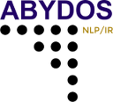

===========================

.. image:: https://travis-ci.org/chrislit/abydos.svg
    :target: https://travis-ci.org/chrislit/abydos
    :alt: Build Status

.. image:: https://coveralls.io/repos/chrislit/abydos/badge.svg
    :target: https://coveralls.io/r/chrislit/abydos
    :alt: Coverage Status

.. image:: https://codeclimate.com/github/chrislit/abydos/badges/gpa.svg
   :target: https://codeclimate.com/github/chrislit/abydos
   :alt: Code Climate

.. image:: https://img.shields.io/badge/pylint-9.94/10-brightgreen.svg
    :alt: Pylint Status

.. image:: https://img.shields.io/pypi/v/abydos.svg
    :target: https://pypi.python.org/pypi/abydos
    :alt: PyPI

.. image:: https://readthedocs.org/projects/abydos/badge/?version=latest
    :target: https://abydos.readthedocs.org/en/latest/
    :alt: Documentation Status

.. image:: https://www.openhub.net/p/abydosnlp/widgets/project_thin_badge.gif
    :target: https://www.openhub.net/p/abydosnlp
    :alt: OpenHUB

Abydos NLP/IR library
Copyright 2014-2015 by Christopher C. Little

This library contains code I'm using for research, in particular dissertation research & experimentation.

Required:

- Numpy

Recommended:

- PylibLZMA   (Python 2 only--for LZMA compression string distance metric)

Suggested for testing & QA:

- Nose        (for unit testing)
- coverage.py (for code coverage checking)
- Pylint      (for code quality checking)

-----

To build/install/unittest in Python 2:

::

    sudo python setup.py install
    nosetests -v --with-coverage --cover-erase --cover-html --cover-branches --cover-package=abydos .

To build/install/unittest in Python 3:

::

    sudo python3 setup.py install
    nosetests3 -v --with-coverage --cover-erase --cover-html --cover-branches --cover-package=abydos .

For pylint testing, run:

::

    pylint --rcfile=pylint.rc abydos > pylint.log
